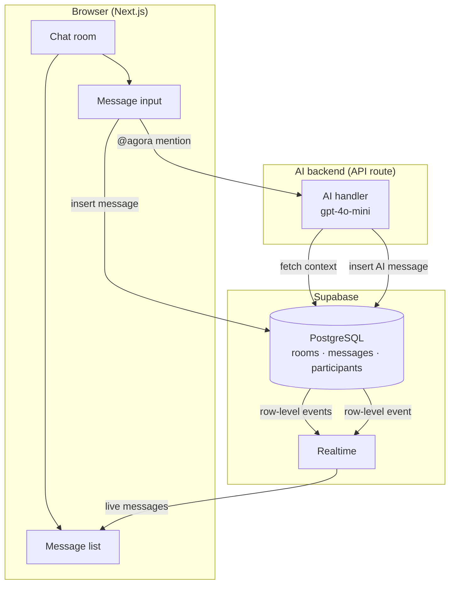
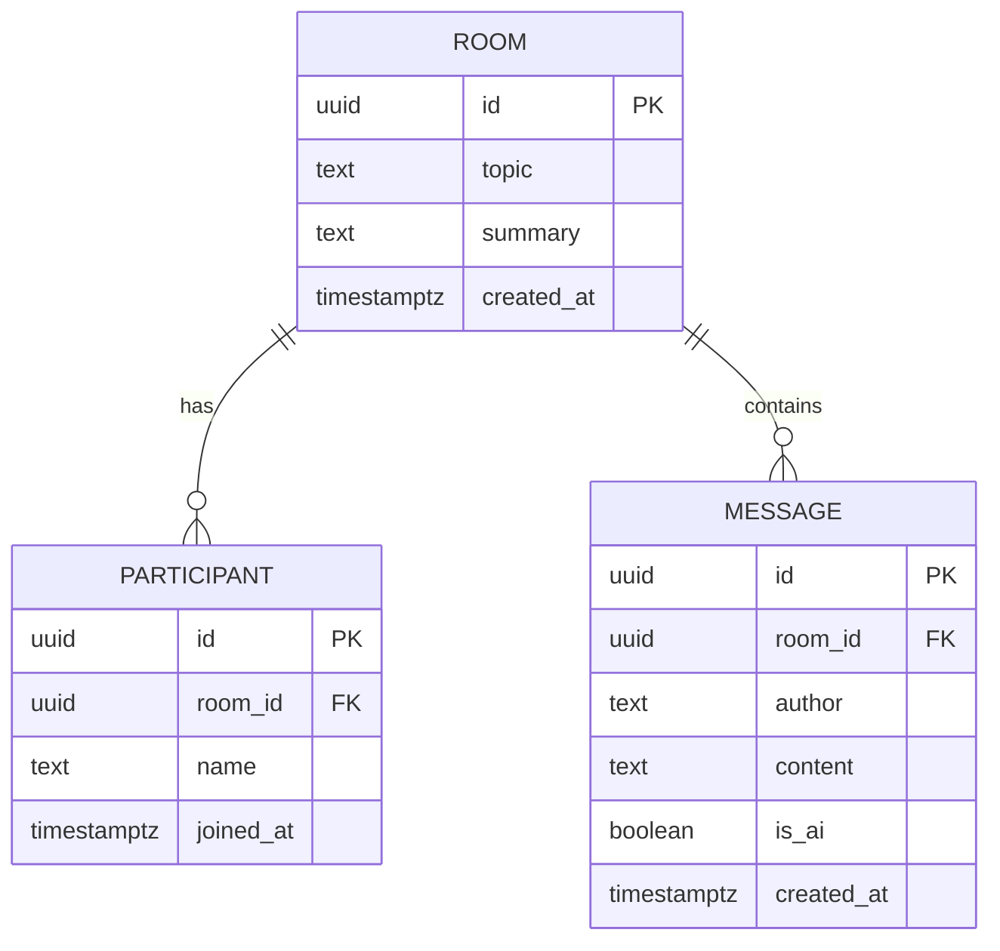
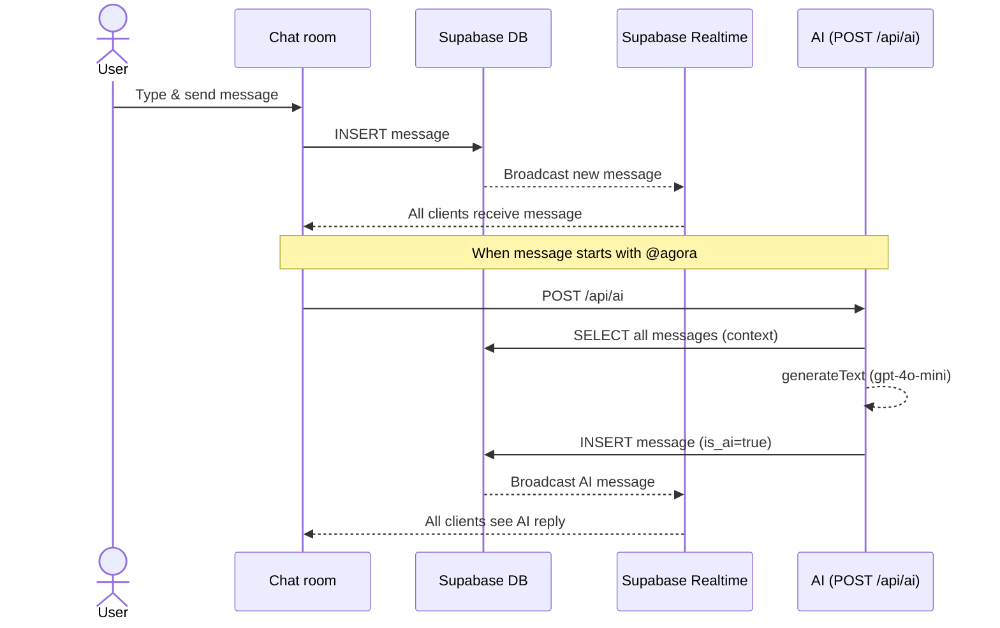

# Agora

Agora is a real-time group chat where users discuss a topic together, with AI acting as a secretary that keeps a live summary and welcomes new participants so they can join without missing context. Users bring AI into the conversation by starting a message with @agora.

In ancient Greece, the _agora_ was the central public space where citizens gathered to debate, deliberate, and exchange ideas. It was the beating heart of democratic discourse.

## Architecture

### System overview



### Data model



### Message & summary flow



## Prerequisites

- [Node.js](https://nodejs.org) 20+
- [Docker Desktop](https://www.docker.com/products/docker-desktop) (for local Supabase)
- A [Supabase](https://supabase.com) project (for cloud deployment)

## Getting started

```bash
# 1. Install dependencies
npm install

# 2. Create .env.local and fill in your credentials
cat > .env.local << 'EOF'
NEXT_PUBLIC_SUPABASE_URL=http://127.0.0.1:54321
NEXT_PUBLIC_SUPABASE_PUBLISHABLE_KEY=<your-local-anon-key>
OPENAI_API_KEY=sk-...
EOF

# 3. Start local Supabase (requires Docker)
npx supabase start

# 4. Apply database migrations
npx supabase db reset

# 5. Start the dev server
npm run dev
```

Open [http://localhost:3000](http://localhost:3000) in your browser.
Supabase Studio is available at [http://localhost:54323](http://localhost:54323).

## Commands

```bash
npm run dev      # development server
npm run validate # validate code and types
npm run build    # production build
npm run start    # production server
```

### Supabase

```bash
npx supabase start                                          # start local Supabase (Docker)
npx supabase stop                                          # stop local Supabase
npx supabase db reset                                      # reset local DB and re-run migrations
npx supabase db push                                       # push migrations to cloud project
npx supabase gen types typescript --local > types/database.ts  # regenerate TypeScript types
```
