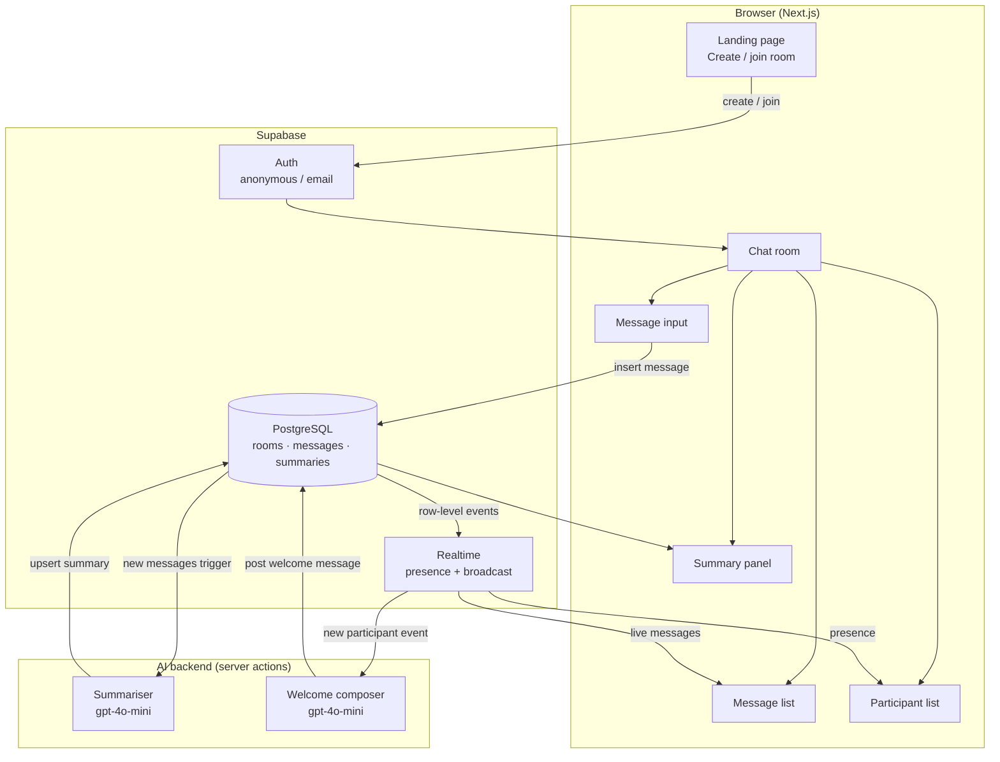
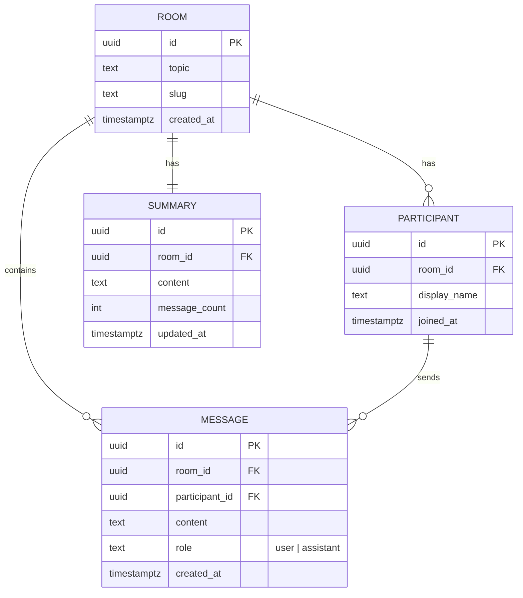
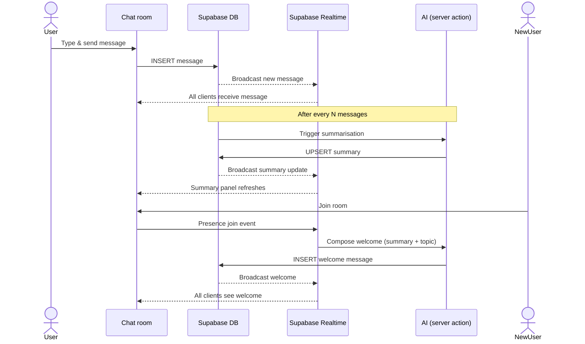

# Agora

This app takes that spirit online: a real-time group chat room built around a chosen topic, where AI acts as a secretary — keeping a live summary of what's been discussed and welcoming new participants so they can join the conversation without missing context.

In ancient Greece, the _agora_ was the central public space where citizens gathered to debate, deliberate, and exchange ideas. It was the beating heart of democratic discourse.

## Architecture

### System overview



### Data model



### Message & summary flow



## Prerequisites

- [Node.js](https://nodejs.org) 20+
- [Docker Desktop](https://www.docker.com/products/docker-desktop) (for local Supabase)
- A [Supabase](https://supabase.com) project (for cloud deployment)

## Getting started

```bash
# 1. Install dependencies
npm install

# 2. Set up environment variables
#    Copy the template and fill in your Supabase project URL and anon key
#    (Settings → API in the Supabase dashboard)
cp .env.local .env.local   # edit NEXT_PUBLIC_SUPABASE_URL and NEXT_PUBLIC_SUPABASE_ANON_KEY

# 3. Start local Supabase (requires Docker)
npx supabase start

# 4. Apply database migrations
npx supabase db reset

# 5. Start the dev server
npm run dev
```

Open [http://localhost:3000](http://localhost:3000) in your browser.
Supabase Studio is available at [http://localhost:54323](http://localhost:54323).

## Commands

```bash
npm run dev      # development server
npm run build    # production build
npm run start    # production server
npm run lint     # linter
```

### Supabase

```bash
npx supabase start                                          # start local Supabase (Docker)
npx supabase stop                                          # stop local Supabase
npx supabase db reset                                      # reset local DB and re-run migrations
npx supabase db push                                       # push migrations to cloud project
npx supabase gen types typescript --local > types/database.ts  # regenerate TypeScript types
```
